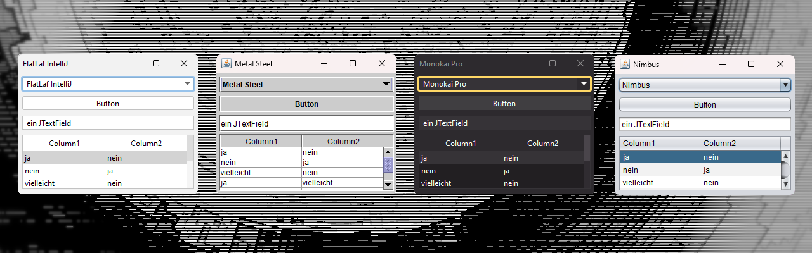

# LAFManager

LAFManager ist eine Java Bibliothek, mit Hilfe dessen man seine Swing-Anwendung
optisch anders darstellen kann. LAFManager ist ein kleiner Helfer, der mit sehr
wenig Code das "Look and Feel" (LaF) einer Swing-Anwendung verändern kann.
Diese Bibliothek enthält auch einige Look & Feels des wunderbaren Projekts [FlatLaf](https://github.com/JFormDesigner/FlatLaf)
von der Firma [FormDev Software GmbH](https://www.formdev.com/).
Diese Bibliothek wurde mit Java 17 getestet.

## Screenshots



## Installation

**Das muss in die pom.xml:**

```xml
<dependency>
    <groupId>de.schipplock.gui.swing</groupId>
    <artifactId>lafmanager</artifactId>
    <version>0.0.1</version>
</dependency>
```

## Wie verwende ich diese Bibliothek?

**Es wird folgender Import benötigt:**

```java
import de.schipplock.gui.swing.lafmanager.LAFManager;
```

**Das Aussehen ändern, bevor irgendwelche Fenster und Dialoge erzeugt wurden:**

```java
LAFManager.create().setLookAndFeelByName(LAFManager.DEFAULT_LOOK_AND_FEEL);
```

**Das Aussehen ändern, wenn bereits Fenster und Dialoge erzeugt wurden:**

```java
LAFManager.create().setLookAndFeelByName(Erscheinungsbild.DEFAULT_LOOK_AND_FEEL).redraw();
```

**Alle Themes in einer ComboBox:**

```java
JComboBox<String> lafComboBox = new JComboBox<>(LAFManager.create().getInstalledLookAndFeelNames());

lafComboBox.addActionListener(e -> {
    String selectedLookAndFeelName = lafComboBox.getItemAt(lafComboBox.getSelectedIndex());
    LAFManager.create().setLookAndFeelByName(selectedLookAndFeelName).redraw();
});
```

## License
[Apache License 2.0](https://choosealicense.com/licenses/apache-2.0/)